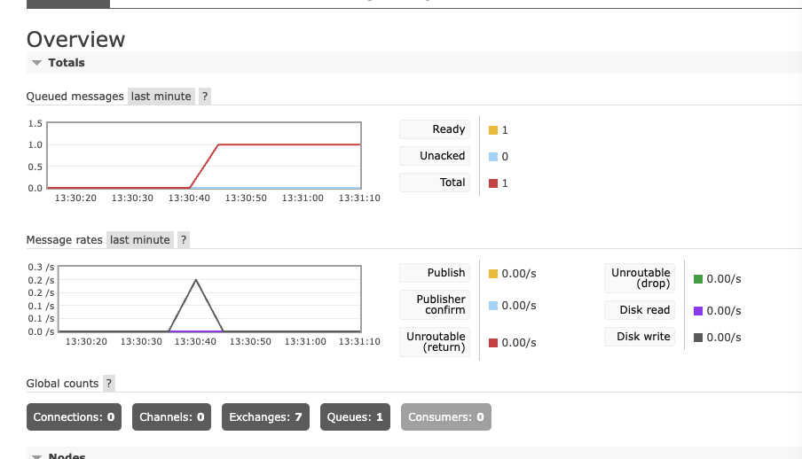
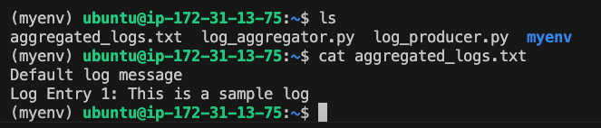

## Steps to follow:

1. Installing and configure rabbitmq on ec2:
    
    https://www.rabbitmq.com/docs/ec2
    
    https://medium.com/@aeroleonsconsultancy/setting-up-rabbitmq-on-amazon-ec2-a-comprehensive-guide-d1489732096d
    
    https://dev.to/fidelisesq/distributed-logging-system-with-rabbitmq-4d0e
    ```
    Default Port:
        Web UI: 15672
        AMQP (message protocol): 5672
    ```

    ```
    ssh -i "rabbitmq.pem" ubuntu@ec2-54-177-24-68.us-west-1.compute.amazonaws.com
    ```
2. Install and update your package list
    ```
    sudo apt-get update
    sudo apt-get install rabbitmq-server -y
    sudo systemctl enable rabbitmq-server
    ```
3. Configuring Rabbitmq
    Enable management plugin
    ```
    sudo rabbitmq-plugins enable rabbitmq_management
    sudo systemctl restart rabbitmq-server
    sudo systemctl status rabbitmq-server.service
    ```
4. creating rabbitmq user:
    ```
    sudo rabbitmqctl add_user myuser mypassword
    sudo rabbitmqctl set_user_tags myuser administrator
    sudo rabbitmqctl set_permissions -p / myuser ".*" ".*" ".*"
    ```
5. Accessing the Management Console
    http://<your_ec2_public_ip>:15672/
    

6. Configure Network Access:
    I did not have etc/rabbitmq/rabbitmq.conf instead had etc/rabbitmq/rabbitm-env.conf
    hence, I created etc/rabbitmq/rabbitmq.conf
    ```
    sudo nano /etc/rabbitmq/rabbitmq.conf
    
    added:
    listeners.tcp.default = 5672
    management.listener.port = 15672
    ```
    had some issues in this step:
    ```
    sudo ufw allow 5672/tcp
    sudo ufw allow 15672/tcp
    ```
7. Implement log producer and consumer using rabbitmq.
    ```
    sudo apt install python3-pip
    got error for pip install pika
    sudo apt install python3-venv
    python3 -m venv myenv
    source myenv/bin/activate
    (myenv) ubuntu@ip-x-x-x-x:~$ pip install pika
    to deactivate the myenv: deactivate
    ```
8. create and ran the producer and consumer python file.
    ```
    (myenv) ubuntu@ip-x-x-x-x:~$ python3 log_producer.py
    [x] Sent 'Default log message'
    (myenv) ubuntu@ip-x-x-x-x:~$ 
    ```

    

    ```
    (myenv) ubuntu@ip-x-x-x-x:~$ python3 log_producer.py "Log Entry 1: This is a sample log"
    [x] Sent 'Log Entry 1: This is a sample log'

    (myenv) ubuntu@ip-x-x-x-x:~$ python3 log_aggregator.py
    [*] Waiting for logs. To exit press CTRL+C
    [x] Received: Log Entry 1: This is a sample log
    [x] Log saved to file
    ```

    


